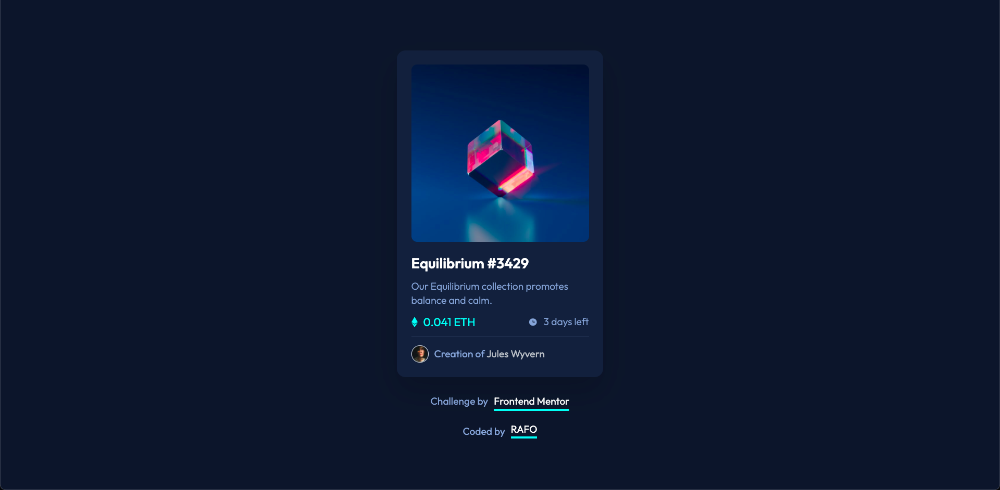

# Frontend Mentor - NFT preview card component solution

This is a solution to the [NFT preview card component challenge on Frontend Mentor](https://www.frontendmentor.io/challenges/nft-preview-card-component-SbdUL_w0U). Frontend Mentor challenges help you improve your coding skills by building realistic projects.

## Table of contents

- [Overview](#overview)
  - [The challenge](#the-challenge)
  - [Screenshot](#screenshot)
  - [Links](#links)
- [Built with](#built-with)

## Overview

### The challenge

Users should be able to:

- View the optimal layout depending on their device's screen size
- See hover states for interactive elements

### Screenshot

### Links

- Solution URL: [Repository](https://github.com/rafae2k/nft-card-frontendmentor)

- Live Site URL: [Live site](https://nft-preview-card-component-main-o3zwi82to-rafae2k.vercel.app/)

## Built with

- Semantic HTML5 markup
- [TailwindCSS](https://tailwindcss.com/)
- CSS custom properties
- Flexbox
- CSS Grid
- Mobile-first workflow
